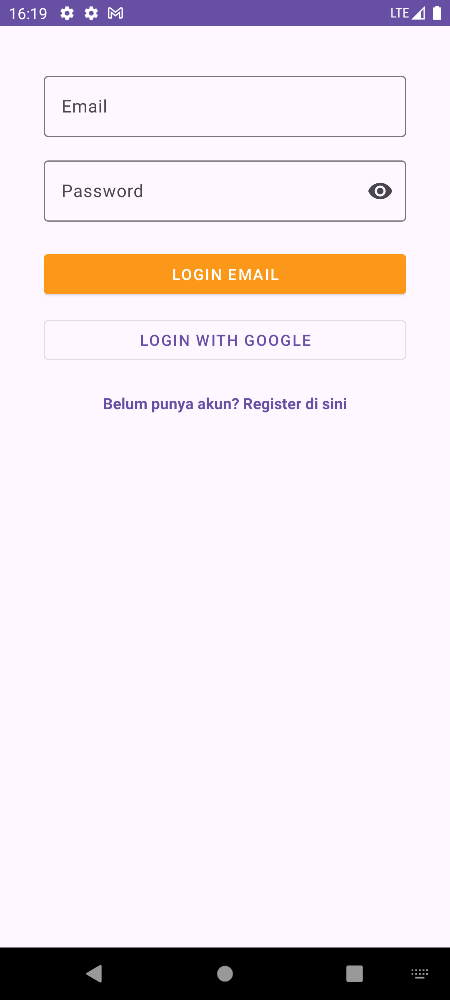
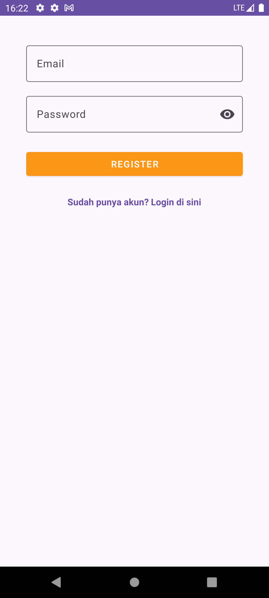
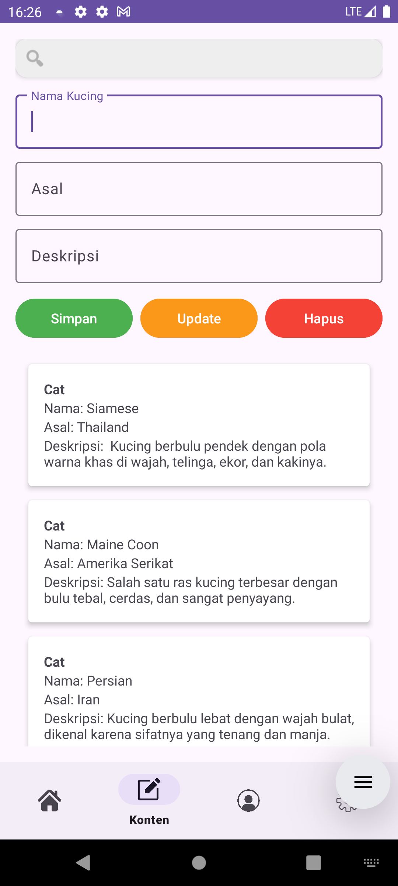
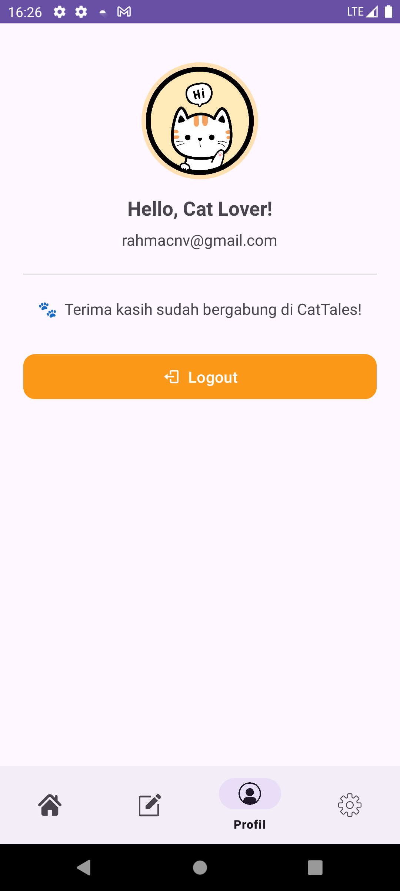
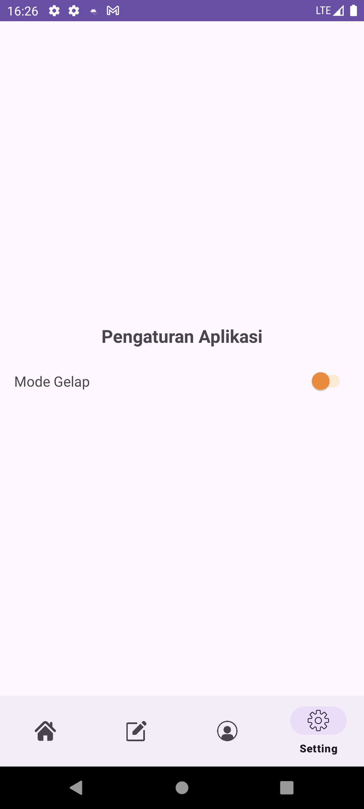

# 🐾 CatTales: Explore the World of Cats! 🐱

**CatTales** adalah sebuah aplikasi hiburan dan informasi yang dirancang khusus untuk para pecinta kucing. Aplikasi ini menyajikan berbagai informasi menarik seputar kucing, mulai dari nama-nama kucing, asal-usulnya, hingga deskripsi unik dari setiap jenis kucing. Tidak hanya itu, pengguna juga dapat menambahkan informasi kucing kesayangan mereka ke dalam aplikasi ini!

---

## ✨ Fitur Utama Aplikasi CatTales

### 📖 Informasi Lengkap Tentang Kucing
Jelajahi berbagai jenis kucing beserta nama, asal-usul, dan deskripsi unik yang informatif serta menarik.

### 📝 Kelola Data Kucing
Tambah, perbarui, dan hapus informasi kucing kesayangan Anda dengan mudah dan praktis melalui aplikasi.

### 🌙☀️ Dark & Light Mode
Sesuaikan tampilan aplikasi sesuai kenyamanan Anda — tersedia mode gelap dan terang yang dapat dipilih kapan saja.

### 🔔 Notifikasi Interaktif
Dapatkan notifikasi otomatis setiap kali Anda menambahkan, memperbarui, atau menghapus data kucing. Proses penting pun tidak akan terlewat.

### 🌈 Antarmuka Pengguna Menarik & Ramah
Desain aplikasi yang sederhana, bersih, dan mudah digunakan — cocok untuk semua kalangan pecinta kucing.

### 😸 Aplikasi Hiburan Kucing
Temukan berbagai fakta lucu, unik, dan menarik tentang dunia kucing yang dapat membuat hari Anda lebih ceria.

### 📱 Sensor Goyang (Shake Detector)
Goyangkan ponsel Anda untuk menampilkan notifikasi berisi fakta menarik tentang kucing secara acak, menggunakan fitur accelerometer.

---

## 📱 Screenshot Aplikasi
Berikut adalah tampilan dari aplikasi **CatTales**:

### **Halaman Login**

  

### **Halaman Register**

  

### **Halaman Utama**

  

### **Halaman Konten**

  

### **Halaman Profil**

  

### **Halaman Setting**

  

